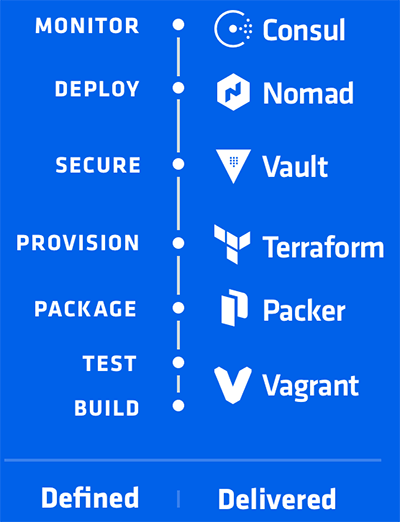

TIL :: 18_12_30

## term

- string interpolation : ${string}
- here doc : <<EOF ~~~~ EOF


## terraform

- [terraform docs](https://www.terraform.io/docs/configuration/load.html)
- terraform은 hashcorp의 devops단계 중 provisioning
- HCL (hashcorp configuration language)를 사용
```hcl
resource TYPE NAME {
  CONFIG ... 
  [count = COUNT]
  [depends_on = [RESOURCE NAME, ...]]
  [provider = PROVIDER]

  [LIFECYCLE]

  [CONNECTION]
  [PROVISIONER ...]
}
```

### provider
- Provider는 리소스의 라이프 사이클을 관리할 책임을 지고 있고 TYPE의 접두사가 Provider.
- aws_instance의 provider는 aws
- [aws provider](https://www.terraform.io/docs/providers/aws/index.html)
```hcl 
provider "aws" {
  access_key = "foo"
  secret_key = "bar"
  region = "us-east-1"
}
```

### data
- provider에서 data를 가져올 수 있음
```hcl
data "aws_ami" "web" {
  filter {
    name = "state"
    values = ["available"]
  }
  filter {
    name = "tag:Component" // tag에 component = web 으로 설정한걸 filter
    values = ["web"]
  }
  most_recent = true
}
```

### variable
- 변수는 여러 설정에서 사용 할 수 있다
- type은 선언하지 않으면 자동으로 추
```hcl
variable "key" {
  type = "string"
}

variable "images" {
  type = "map"

  default = {
    us-east-1 = "image-1234"
    us-west-2 = "image-4567"
  }
}

variable "zones" {
  default = ["us-east-1a", "us-east-1b"]
}
```

### module
- 미리 정의된 resource 그룹
```hcl
module "consul" {
  source = "github.com/hashicorp/consul/terraform/aws"
  servers = 5
}
```


### terraform.tfstate
- 실제 infra와 local terraform과의 중간 매게 역활을 하는 파일
- terraform으로 적용된 infra 설정을 저장하고 있는 파일
- git으로 관리 했을 때 여러 개발자들이 관리하면 충돌을 야기하고 이는 곧 infra에 영향을 끼칠 수 있다.
- 작업 전 git pull을 받지 않으면 이전 상태의 infra 위에서 작업을 할 수 있다.
- 원격으로 관리해보자! [지원하는 원격 저장소 docs](https://www.terraform.io/docs/backends/types/index.html)
- terraform init은 provider config 파일을 읽어 작동하는게 아니라 환경변수나 mac기준 ~/.aws/credentials를 읽어 동작
- terraform 설정 파일에서는 string interpolation을 사용 할 수 없음 ( terraform의 가장 base가 되는 설정 파일이므로 )


### terraform cheat-sheet

resource destroy all
- terraform plan -destroy
- terraform destroy

resource graph
- terraform graph [시각화 서비스](https://dreampuf.github.io/GraphvizOnline/#digraph%20%7B%0A%09compound%20%3D%20%22true%22%0A%09newrank%20%3D%20%22true%22%0A%09subgraph%20%22root%22%20%7B%0A%09%09%22%5Broot%5D%20aws_instance.example-server%22%20%5Blabel%20%3D%20%22aws_instance.example-server%22%2C%20shape%20%3D%20%22box%22%5D%0A%09%09%22%5Broot%5D%20aws_security_group.example-allow-all%22%20%5Blabel%20%3D%20%22aws_security_group.example-allow-all%22%2C%20shape%20%3D%20%22box%22%5D%0A%09%09%22%5Broot%5D%20aws_subnet.example-a%22%20%5Blabel%20%3D%20%22aws_subnet.example-a%22%2C%20shape%20%3D%20%22box%22%5D%0A%09%09%22%5Broot%5D%20aws_subnet.example-c%22%20%5Blabel%20%3D%20%22aws_subnet.example-c%22%2C%20shape%20%3D%20%22box%22%5D%0A%09%09%22%5Broot%5D%20aws_vpc.example%22%20%5Blabel%20%3D%20%22aws_vpc.example%22%2C%20shape%20%3D%20%22box%22%5D%0A%09%09%22%5Broot%5D%20data.aws_ami.ubuntu%22%20%5Blabel%20%3D%20%22data.aws_ami.ubuntu%22%2C%20shape%20%3D%20%22box%22%5D%0A%09%09%22%5Broot%5D%20provider.aws%22%20%5Blabel%20%3D%20%22provider.aws%22%2C%20shape%20%3D%20%22diamond%22%5D%0A%09%09%22%5Broot%5D%20aws_instance.example-server%22%20-%3E%20%22%5Broot%5D%20aws_security_group.example-allow-all%22%0A%09%09%22%5Broot%5D%20aws_instance.example-server%22%20-%3E%20%22%5Broot%5D%20aws_subnet.example-a%22%0A%09%09%22%5Broot%5D%20aws_instance.example-server%22%20-%3E%20%22%5Broot%5D%20data.aws_ami.ubuntu%22%0A%09%09%22%5Broot%5D%20aws_instance.example-server%22%20-%3E%20%22%5Broot%5D%20var.key_pair%22%0A%09%09%22%5Broot%5D%20aws_security_group.example-allow-all%22%20-%3E%20%22%5Broot%5D%20aws_vpc.example%22%0A%09%09%22%5Broot%5D%20aws_subnet.example-a%22%20-%3E%20%22%5Broot%5D%20aws_vpc.example%22%0A%09%09%22%5Broot%5D%20aws_subnet.example-c%22%20-%3E%20%22%5Broot%5D%20aws_vpc.example%22%0A%09%09%22%5Broot%5D%20aws_vpc.example%22%20-%3E%20%22%5Broot%5D%20provider.aws%22%0A%09%09%22%5Broot%5D%20data.aws_ami.ubuntu%22%20-%3E%20%22%5Broot%5D%20provider.aws%22%0A%09%09%22%5Broot%5D%20meta.count-boundary%20(count%20boundary%20fixup)%22%20-%3E%20%22%5Broot%5D%20aws_instance.example-server%22%0A%09%09%22%5Broot%5D%20meta.count-boundary%20(count%20boundary%20fixup)%22%20-%3E%20%22%5Broot%5D%20aws_subnet.example-c%22%0A%09%09%22%5Broot%5D%20provider.aws%20(close)%22%20-%3E%20%22%5Broot%5D%20aws_instance.example-server%22%0A%09%09%22%5Broot%5D%20provider.aws%20(close)%22%20-%3E%20%22%5Broot%5D%20aws_subnet.example-c%22%0A%09%09%22%5Broot%5D%20root%22%20-%3E%20%22%5Broot%5D%20meta.count-boundary%20(count%20boundary%20fixup)%22%0A%09%09%22%5Broot%5D%20root%22%20-%3E%20%22%5Broot%5D%20provider.aws%20(close)%22%0A%09%7D%0A%7D)

resource import
- terraform import aws_key_pair.mykey my-key-pair-in-aws

 