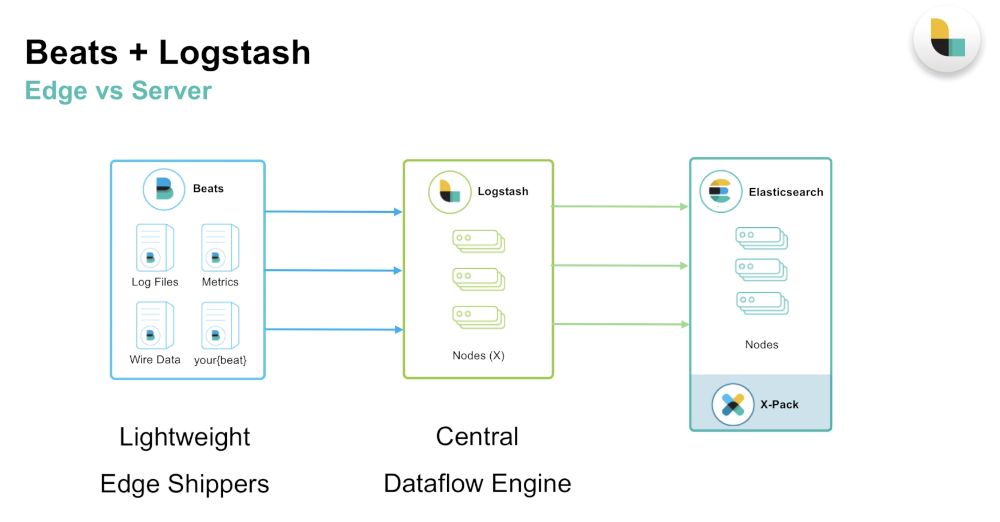

TIL :: 18_12_31

## logstash
- Dataflow engine
- 데이터 흐름을 위한 중앙 처리 엔진
- dataflow pipeline 구축 -> event data의 변환 및 스트림 설정
- 버퍼링을 통한 horizontal scaling
- plugin 구성
- ruby코드를 java로 compile해서 compile된 데이터를 java위에서 동작
- input, output 설정이 없으면 실행이 되지 않는다
    - big/logstash -e 'input { stdin { } } output { stdout { } }'
    - bin/logstash -f {configfile path}

### logstash pipeline
- 한번에 구성하기 보다는 점진적으로 추가하는 형태 개발하면 좋음

### beats + logstash


### logstash datasource
- app
- message queue
- aws s3, cloudwatch, ..
- database
- ..

### logstash filter
- log parsing
- 데이터 확장
- 태그 추가
- and more!

### logstash output
- elasticsearch
- data 보관소 ( s3, .. )
- Alerting & Monitoring system
- and more!

### logstash execution model
- input으로 들어온 데이터를 codec을 거쳐 logstash의 work queue를 거치고 logstash의 batcher를 통해 filter되고 codec된 데이터가 output으로 출력
- logstash의 설정으로 work queue 개수를 설정 할 수 있다
- batcher를 통해 bulk로 output으로 나가게 되어 성능상 이점이 있다

### logstash file 구조
- bin 폴더 밑에 실행 파일 ( bing/logstash )
- config 폴더 밑에 설정 파일
    - config
        - jvm.options
        - log4j2.properties
        - logstash.yml
        - pipeline.yml
        
### lostash.yml
- pipeline.workers: 2 // 더 많은 cpu core를 logstash 작업에 사용하고 싶다면 늘린다
- pipeline.output.workers: 1 // 출력 쪽 worker 지정
- pipeline.batch.size: 125 // 들어오는 event data를 몇개씩 묶어서 batch로 만들지 설
- pipeline.batch.delay: 5 // ms, batcher의 동작 delay 
    - throughput을 늘리려면 batch size, delay를 늘리면 되는데 이때 heap memory를 같이 늘려줘야 올바른 동작을 한다
- config.reload.automatic: false // input, output이 변경 됬을 때 자동 재실행
- config.reload.interval: 3s // reload term 시간 설정
- path.config: {config 경로} //

### logstash config
```yaml
input {
  stdin { }
}

output {
  stdout {
    codec => rubydebug
  }
}
```
```yaml
input {
  tcp {
    port => 9900
  }
}

filter {
  grok {
    match -> { "message" => "Hello %{WORD:name}" } // 미리 정의된 WORD패턴을 name이란 이름으로 지정
  }
}

output {
  stdout {
    codec => rubydebug
  }
}
```
```yaml
input {
  tcp {
    port => 9900
    type => "apache"
  }
  
  beats {
    port => 5044
  }
  
  jdbc { // jdbc plugin
    jdbc_user => "mysql"
    
    sechedule => "* * * * *"
    parameters => { "company" => "elastic" }
    use_comlumn_value => true
    tracking_column => id
    
    statement => "SELECT * FROM my_table WHERE id > :sql_last_value"
  }
}

filter {
  if [type] == "apache" {
    grok {
      match => {
        message => "%{COMBINEDAPACHELOG}"
        remove_filed => "message"
      }
    }
    
    geoip {
      source => "clientip"
      fields => ["city_name", "country_name", "location", "region_name"]
    }
    
    date {
      match => "timestamp", "dd/MMM/yyyy:HH:mm:ss Z"]
      remove_field => "timestamp"
    }
  }
}

output {
  elasticsearch {
    hosts => ["localhost:9200"]
  }
  
  s3 {
    access_key_id => ""
    secret_access_key => ""
    region => ""
    bucket => ""
    size_file => 2048
    time_file => 5
  }
}
```

### logstash grok pattern
- [미리 정의된 grok pattern](https://github.com/logstash-plugins/logstash-patterns-core/tree/master/patterns)

### elasticsearch rest api
- curl -XGET localhost:9600/_cat/indices
- curl -XGET localhost:9600/_node?pretty
- curl -XGET localhost:9600/_node/stats?pretty

---

## jetbrain live template
- [jetbrain live template example](https://github.com/blakedietz/js-live-template)
