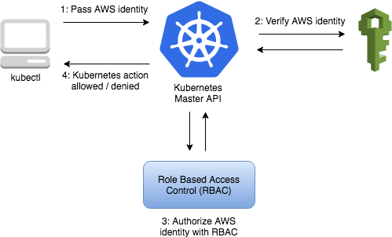

TIL :: 19_03_07

### EKS
- cluster 생성 ( iam role 필요 )
```sh
$ eksctl create cluster \
  --name myeks \
  --nodes 4 \
  --node-ami=auto \
  --region ap-northeast-2
  --role-arn arn:aws;iam:xxxxx:role/eks-service-role-AWSServiceRoleForAmazonEKS-xxx
  --resources-vpc-config subnetIds=subent-xxxx,subnet-xxx,securityGroupIds=sg-xxxx

$ aws eks describe-cluster --name myeks --query cluster.status
```
- kubeconfig 생성 및 업데이트
  - ```.kube/config```에 kubeconfig 생성; 해당 위치의 기존 kubeconfig와 병합 (다른 경로로 지정하려면 --kubeconfig option 사용)
  - eks 생성 시 --role-arn option으로 IAM 역할 ARN을 지정하면 kubectl 명령을 실행할 때 인증에 사용
    - 지정하지 않으면 AWS CLI or SDK 자격 증명체인의 IAM 사용 ```aws sts get-caller-identity```로 확인
```sh
$ aws eks update-kubeconfig --name myeks --alias {myeksAlias}

// test
$ kubectl get svc

// result
NAME             TYPE        CLUSTER-IP   EXTERNAL-IP   PORT(S)   AGE
svc/kubernetes   ClusterIP   10.100.0.1   <none>        443/TCP   1m
```
- EKS는 iam RBAC을 통해 클러스터 인증을 한다.

```sh
$ curl -o aws-iam-authenticator https://amazon-eks.s3-us-west-2.amazonaws.com/1.10.3/2018-07-26/bin/darwin/amd64/aws-iam-authenticator
$ chmod +x ./aws-iam-authenticator
$ makedir -p ~/bin && touch ~/bin/aws-iam-authenticator
$ cp ./aws-iam-authenticator $HOME/bin/aws-iam-authenticator && export PATH=$HOME/bin:$PATH
$ echo 'export PATH=$HOME/bin:$PATH' >> ~/.zshrc
```

- EKS worker node 구성
  - [EKS AMI for worker node](https://github.com/awslabs/amazon-eks-ami/)
  - [terraform aws eks](https://github.com/terraform-aws-modules/terraform-aws-eks/)

- k8s official dashboard ( use on only dev environment )
```sh
$ kubectl apply -f https://raw.githubusercontent.com/kubernetes/dashboard/v1.10.1/src/deploy/recommended/kubernetes-dashboard.yaml
$ kubectl proxy --port=8080 --address='0.0.0.0' --disable-filter=true &
```
- kubernetes 버전업 대응
  - kubernetes version upgrade
  - eks platform version upgrade
  - ```sh
    $ aws eks update-cluster-version --name {clusterName} -kubernetes-version {version: 1.11} // default version은 lts
    $ aws eks list-updates -name {clusterName} // 클러스터에 대한 진행 중인 업데이트가 반환
    $ aws eks describe-update -name {clusterName} -update-id {UUID}
    ```

#### beanstalk을 하루 써보면서
- 뚝딱뚝딱하면 lb, ag, 로깅등 바로 설치해준다.
- docker를 지원하여 내부적으로 ECS가 돈다
- 그렇다면 로깅 시스템 구축은?
  - 매번 배포 시 agent 설치 및 설정 & 구동을 해야하는가? -> AMI 말아서 적용
  - ec2 volume이 매번 죽었다 살아났을 때의 이슈는 없는가?
  - volume culating은 어떤식으로? 
    - lambda로 처리 한다고 했을 때 service discovery는 어떤식으로?
    - ec2 내부에 매번 batch를 돌려야 하는가?
      - 그렇다면 주기는? 용량으로?
- 배포 전략은?
  - url swap은 자동화가 안되는가?
- 어짜피 내가 또 다 configuation 해야하잖아???
  - ebextension 작성
- ec2 nginx 안에 docker 안에 nginx??
- 롤백은 어떤식으로? 
  - 롤백도 새로운 ec2가 뜨는가?
- ci/cd 구축 할 때 배포 환경 create는 어떤식으로 자동화를 할 수 있는가?
  - eb status를 읽어 eb create or deploy 자동화
  - ecr를 활용하는 이유는?
    - docker image를 사용한다고 했을 때 어떤 workflow일까?

#### jq
- cli에서 json을 다룰 수 있는 툴
- install   
```sh
$ brew install jq 
$ vi index.json

{
    "dev": {
        "name": "dev",
        "version": 2
    },
    "production": {
        "name": "release",
        "version": 1
    }
}

$ cat index.json | jq .production.name
```

#### 배포전략
- rollingUpdate
  - 배포, 롤백이 느리다. -> blue / green
- blue / green
  - resource x2 장애가 났을 경우 비효율 -> canary
- canary
  - canary는 cache, heap등이 없기때문에 완벽한 장애 체크를 할 수 있을까?
- baseline canary
  - v1, v2 둘 다 canary로 배포를 해서 동일하게 5%씩 traffic을 걸어서 비교를 한다.


#### service mesh
- timeouts & retries
- circuit breaking
- canary release
- rate limiting
- request shadowing
  - prod로 들어오는 req를 staging으로 mirroring해라


#### CNCF semin
- multi cloud service mesh
    - multi cloud? :: workload, 적용기술
        - hybrid cloud
        - extend cloud
        - HA cloud (2중화)
        - Bursting cloud (scale out)
    - service mesh
        - istio
            - traffic managemnet
            - telemetry
            - security
    - multi cloud + service mesh
        - istio remote를 통해 remote cloud에는 data plane만 설정
        - Q: istio canary deployment automation (virtualService)
        - multi cloud 통신 :: strongswarn (helm)
        - kubectl apply ? replace ?

        - istio에서의 숙제
            - istio telemetry의 multi cloud platform에서 tracing이 불편
            - service mesh로 묶을 필요가 없는 service들을 묶는 방법?
            - control plan HA 구성

        - kubernetes faderaction ??
        - istio의 soft multi tanent
- kubeflow
    - 