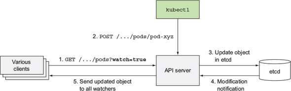
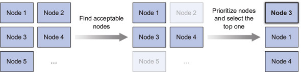

TIL :: 19_03_25

## kubernetes in action 11장 (쿠버네티스 내부 이해하기) - 김동현님 발표

### Architecture
- master component
  - etcd
  - api server
  - scheduler
  - controller manager
- node component
  - kubelet
  - kubernetes service proxy (kube proxy)
  - container runtime
- add-on component
  - DNS server
  - CNI
  - dashboard
  - ingress controller


### component 상태 확인
```bash
$ kubernetes get componentstatus
NAME                 STATUS    MESSAGE              ERROR
scheduler            Healthy   ok
controller-manager   Healthy   ok
etcd-0               Healthy   {"health": "true"}
```
- 해당 cmd를 받는 주체가 api server이므로 api server의 status를 출력x
- 실제론 api server를 통해 etcd의 값을 checking하는 것 -> etcd의 상태는 저장된 상태 그대로를 출력

### component HA
- master
  - etcd clustering
  - API server는 stateless이므로 여러개를 띄울 수 있다(Multi Active) -> LB or VIP를 달아야함
  - scheduler
    - multiple scheduler(https://kubernetes.io/docs/tasks/administer-cluster/configure-multiple-schedulers/?fbclid=IwAR0STX0GIZkH_Co3Wiu_0GsjiSRVEWC2DkYS2rqXOjIF_bWA3e3F0HpI7is)
    - Running Multiple Schedulers in Kubernetes by Xiaoning Ding, Huawei(https://www.youtube.com/watch?v=avORKrcyctM&feature=youtu.be&fbclid=IwAR0jddEvXcMt3ekCnbfbOHt3QA9TWFS035ZlcnRpc_Qb_WdJx7RXGeLeZ-A)
  - controller manager는 Active - Standby

### etcd
- api server의 database역활
- api server외의 모든 component들은 api server를 통해서만 etcd에 접근
  - 저장소 추상화
  - 유효성 검사
  - optimistic locking
    - kubernetes 모든 리소스는 metadata.resourceVersion 필드가 있다.
    - 만약 리소스 업데이트를 api server 통해 요청할 때 etcd에 있는 version 정보와 다르면 api server는 갱신을 거절한다.
    - client는 새로운 데이터를 다시 읽고 업데이트를 다시 시도한다.
- etcd cluster
  - Quorum 유지를 통한 분산된 etcd 클러스터의 일관성
    - 여러 사람의 합의로 운영되는 의사기관에서 의결을 하는데 필요한 최소한의 참석자 수
  - RAFT consensus algorithm
    - consensus란 분산 시스템에서 node간 상태를 공유하는 algorithm
    - distributed consensus problem: 여러 노드로 이루어진 분산 서버에서 합의를 이루어내야하는 상태
    - RAFT
      - 3가지 state를 가진다: follower, candidate, leader
      - 최초에 모든 node는 follower로 시작
      - 각 노드는 election timeout이 150ms ~ 300ms사이 랜덤하게 부여된다.
      - election timeout동안 leader에게 요청을 받지 못한 첫번째 node가 candidate가 된다.
      - election term이 시작되고 자기 자식에게 vote를 하고 다른 node들에게 vote 요청을 보낸다.
      - 만약 요청을 받은 node가 election term동안 투표를 하지 않는다면, 요청을 한 candidate에게 투표를 한다. 그리고 election timeout을 reset
      - 가장 투표를 많이 받은 candidate가 leader가 된다.
      - leader는 heartbeat timeout 간격으로 node(follower)들에게 append entries message를 보낸다.
      - follower들은 election timeout이 reset되고 요청에 응답을 보낸다.
      - 만약 leader가 죽는다면 follower들은 election timeout동안 요청을 받지 못하므로 최초로 election timeout이 끝난 node가 candidate가 되고 위 과정을 반복한다.
      - 만약 여러개의 node가 동시에 candidate가 되어 election term이 됬고 동일한 vote를 받았을 경우 새로운 election term이 발동 되고 결국 하나의 leader를 선출한다.

      - log replication
        - leader가 선출되면 heartbeats 간격으로 append entries를 통해 node의 상태를 공유한다.
        - client가 leader에게 데이터를 전달하고 leader log에 데이터를 쓴 후 리더는 다음 heartbeats에 node들에게 append entries로 데이터를 보낸다.
        - follower들에 ack가 왔을 경우 leader는 client에게 response를 보내고 follower들에게 확정 command를 보낸다.
  - split brain방지를 위해 홀수개를 권장
    - split brain: network partitioning의해 sub-cluster형상으로 각 cluster가 primary로 인식하는 상황
    - 

### api server
- cluster 상태를 조회 및 수정할 수 있는 CRUD interface 제공 -> etcd에 저장
- object 유효성 검사
- optimistic locking (etcd2) 
- kuberentes 1.6부터 defualt인 etcd3에선 tx지원
```go
# etcd2

// CompareResourceVersion compares etcd resource versions.  Outside this API they are all strings,
// but etcd resource versions are special, they're actually ints, so we can easily compare them.
func (a APIObjectVersioner) CompareResourceVersion(lhs, rhs runtime.Object) int {
	lhsVersion, err := Versioner.ObjectResourceVersion(lhs)
	if err != nil {
		// coder error
		panic(err)
	}
	rhsVersion, err := Versioner.ObjectResourceVersion(rhs)
	if err != nil {
		// coder error
		panic(err)
	}

	if lhsVersion == rhsVersion {
		return 0
	}
	if lhsVersion < rhsVersion {
		return -1
	}

	return 1
}

# etcd3

// GuaranteedUpdate implements storage.Interface.GuaranteedUpdate.
func (s *store) GuaranteedUpdate(
	ctx context.Context, key string, out runtime.Object, ignoreNotFound bool,
	preconditions *storage.Preconditions, tryUpdate storage.UpdateFunc, suggestion ...runtime.Object) error {
...
  trace.Step("Transaction prepared")

  txnResp, err := s.client.KV.Txn(ctx).If(
    clientv3.Compare(clientv3.ModRevision(key), "=", origState.rev),
  ).Then(
    clientv3.OpPut(key, string(newData), opts...),
  ).Else(
    clientv3.OpGet(key),
  ).Commit()
  if err != nil {
    return err
  }
  trace.Step("Transaction committed")
...
}
```
- api server 동작

  - authentication plugin
  - authorization plugin
  - admission control plugin
  - resource validation

- api server가 resource변화를 감지 및 통지하는 방법

  - 다른 component들은 api server의 watch api를 사용하여 subscribe를 한다.
  - resource의 변경으로 etcd에 값이 update 됬을 때 etcd는 key값을 publish
  - api server는 watch api로 요청한 component들에게 object의 새로운 버전을 notify
  - ```--watch``` 방법
    - http 1.0: body의 new line을 주지 않아서 client가 계속 listening
    - http 1.1: chunked stream
    - 왜 http2를 쓰지 않을까? server push를 통해 쉽게 구현이 가능하지 않을까?


### scheduler
- node에 할당되지 않은 pod을 node에 할당하도록 resource를 update한다.
- 실제 pod 생성은 update된 resource 정보를 통해 kubelet이 실행한다.
- 가령 pod이 kubectl client의 http post 요청으로 api server를 통해 etcd에 저장됬을 때 scheduler는 ```--watch``` api를 통해 node에 할당되지 않은 pod의 resource를 api server를 통해 변경된다. 그러면 kubelet은 ```--watch``` api를 통해 api server에게 pod resource의 새로운 version을 통지 받고 해당 pod을 실행 시킨다.

- filter
  - NoDiskConflict
    - PVC에 의한 checking
    - 지금은 AWS EBS, GCE PD, ISCSI and Ceph RBD만을 지원한다.
    - pod에 직접 연결된 volume은 평가 대상이 안된다.
  - NoVolumeZoneConflict
  - PodFitsResources
  - PodFitsHostPorts
  - HostName
  - MatchNodeSelector
  - MaxEBSVolumeCount
  - MaxGCEPDVolumeCount
  - CheckNodeMemoryPressure
  - CheckNodeDiskPressure
- sort by priority
  - LeastRequestedPriority
  - BalancedResourceAllocation
  - SelectorSpreadPriority
  - CalculateAntiAffinityPriority
  - ImageLocalityPriority
  - NodeAffinityPriority
- [kubernetes scheduler docs](https://github.com/kubernetes/community/blob/master/contributors/devel/sig-scheduling/scheduler.md)
- [scheduler algorithm docs](https://github.com/kubernetes/community/blob/master/contributors/devel/sig-scheduling/scheduler_algorithm.md)
- [multiple scheduler](https://kubernetes.io/docs/tasks/administer-cluster/configure-multiple-schedulers/)


- Question
  - etcd3? transaction?