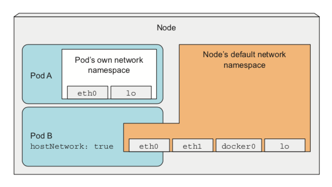
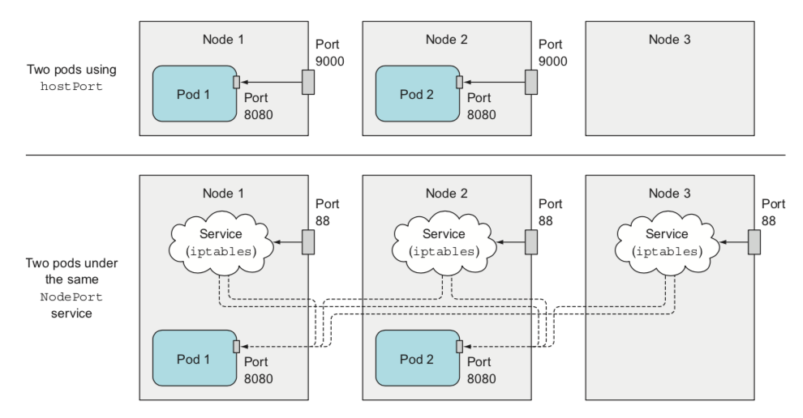

TIL :: 19_03_28

## docker network

- docker host를 설치하면 container가 통신하기 위한 docker0라는 L2기반의 virtual ethernet bridge가 생성되며 docker 내부 로직에 의해 자동으로 172.17.42.1 ip를 할당한다(netmask 255.255.0.0 즉, 172.17.0.0/16). 즉, container가 하나씩 추가될 때 network를 bridge로 설정하면 docker0 bridge에 container network interface가 하나씩 binding된다.
- container가 생성되면 172.17.0.0/16 ip 대역 중 하나를 할당 받는다 (보통 gateway가 172.17.0.1)
- container는 linux namespace를 통해 자신만의 격리된 network interface(eth0)을 갖는다.
- container가 생성되면 pair(peer) interface가 생성되는데 한쪽은 container 내부에(eth0)에 할당되고 다른 한쪽은 docker0 bridge에 vethXXX 이름으로 binding되고 두 interface는 direct로 연결되어 있다.

# kuberenetes securing cluster nodes and the network

## contents
- pod이 node resource에 access하는 방법
- pod의 작업제한
- pod network 보호

## pod 내에서 host node namespace사용하기
- pod내의 container는 node의 기본 namespace에서 실행중인 process와 다른 namespace의 process에서 실행
  - 각 pod은 자체 network namespace를 사용 -> 자체 ip 및 port공간
  - 각 pod에는 고유한 PID namespace -> 동일한 pod process 사이에만 IPC 가능

### pod에서 node network namespace 사용하기
- pod에서 node의 resource나 device를 조작하고 싶을때는 host의 namespace에서 동작해야 한다.
  - pod의 자체 virtual network adapter대신 host network adpater 사용
- master component들을 pod으로 배포하면(kubeadmin을 통해 cluster 배포 경우) 실제론 hostNetwork option을 통해 실제로 pod내에서 실행되지 않은 것처럼 동작
```sh
$ docker run -dit --net=host ...
```


```yml
apiVersion: v1
kind: Pod
metadata:
  name: pod-with-host-network
spec:
  hostNetwork: true
  containers:
  - name: main
    image: alpine
    command: ["/bin/sleep", "999999"]
```

### host namespace를 사용하지 않고 host port에 binding
- host port에 binding하는 방법
  - hostPort
  - service를 통한 NodePort



- hostPort vs NodePort
  - common
    - 2개의 process가 동일한 host port에 binding될 수 없다 -> 배포시 pending
  - difference
    - hostPort의 경우 배포된 node의 iptables에만 등록
    - NodePort로 배포된 경우 모든 node의 iptables에 등록 (loadBalance)
```yaml
apiVersion: v1
kind: Pod
metadata:
  name: express-app
spec:
  containers:
  - image: express:1
    name: kubia
    ports:
    - containerPort: 4000
      hostPort: 9000
      protocol: TCP
```

### node의 PID & IPC namespace 사용
- pod에서 host PID 및 IPC namespace를 사용해 node의 모든 process를 보거나 IPC를 통해 node와 통신할 수 있다.
```yaml
apiVersion: v1
kind: Pod
metadata:
  name: pod-with-host-pid-and-ipc
spec:
  hostPID: true
  hostIPC: true
  containers:
  - name: main
    image: alpine
    command: ["/bin/sleep", "999999"]
```
```sh
# PID, IPC 적용 전
$ kubectl exec express-app ps aux
PID   USER     TIME  COMMAND
    1 root      0:00 npm
   18 root      0:00 node app.js
   35 root      0:00 ps aux

----------------------------------------

# PID, IPC 적용 후
$ kubectl exec express-app ps aux
PID   USER     TIME  COMMAND
    1 root      0:02 /sbin/init text
    2 root      0:00 [kthreadd]
    3 root      0:01 [ksoftirqd/0]
    5 root      0:00 [kworker/0:0H]
    7 root      0:17 [rcu_sched]
    8 root      0:00 [rcu_bh]
    9 root      0:00 [migration/0]
   10 root      0:00 [lru-add-drain]
...
```

## container securityContext 설정
- securityContext 설정 option
  - container process에서 실행할 수 있는 userID 지정
  - container가 root로 실행되는 것 방지
  - container가 privileged mode로 시행해 node의 kernel에 대한 full access권한 부여
  - container process에게 개별 kernel 기능 추가 & 삭제
  - SELinux(Security Enhanced Linux) option
  - process가 container file system에 쓰지 못하게 하기

```yaml
# pod level에서의 securityContext
apiVersion: v1
kind: Pod
metadata:
  name: express-app
spec:
  securityContext:
    runAsUser: 405 # guest user
  containers:
  - name: nginx-container
    image: nginx
  - image: express:3
    name: main
    ports:
    - containerPort: 4000
      hostPort: 9000
      protocol: TCP

# container level에서의 securityContext
apiVersion: v1
kind: Pod
metadata:
  name: express-app
spec:
  securityContext:
    runAsUser: 405 # guest user
  containers:
  - image: express:3
    name: main
    ports:
    - containerPort: 4000
      hostPort: 9000
      protocol: TCP
```

```sh
# default securityContext 설정 :: userID=0(root), gid=0(root)
$ kubectl run alpine --image alpine --restart Never -- /bin/sleep 99999999
$ kubectl exec alpine id
uid=0(root) gid=0(root) groups=0(root),1(bin),2(daemon),3(sys),4(adm),6(disk),10(wheel),11(floppy),20(dialout),26(tape),27(video)
```
### container를 특정 사용자로 실행
```yaml
# deployment
apiVersion: v1
kind: Pod
metadata:
  name: express-app
spec:
  containers:
  - image: express:3
    name: kubia
    ports:
    - containerPort: 4000
      hostPort: 9000
      protocol: TCP
    securityContext:
      runAsUser: 405 # guest user
```
```Dockerfile
# Dockerfile
FROM node:lts-alpine

ENV PROJECT_ROOT /usr/src/app

WORKDIR ${PROJECT_ROOT}

RUN adduser --disabled-password --gecos '' noroot
RUN chown -R noroot:noroot $PROJECT_ROOT
USER noroot

COPY package*.json ./
RUN npm install

COPY . ${PROJECT_ROOT}

EXPOSE 4000
ENTRYPOINT ["/usr/local/bin/npm"]
CMD ["start"]
```
```sh
$ kubectl exec express-app id
uid=405(guest) gid=100(users)

$ kubectl exec express-app id
uid=1001(noroot) gid=1001(noroot)
```

### container가 root로 실행되는 것을 방지
- Docker registry에 접속해 Dockerfile을 변경해 root로 실행할 수 있을 수 있다.
- kubernetes 배포시 root user로 실행되는 것을 방지할 수 있다.

```yaml
# deployment
apiVersion: v1
kind: Pod
metadata:
  name: express-app
spec:
  containers:
  - image: express:3
    name: kubia
    ports:
    - containerPort: 4000
      hostPort: 9000
      protocol: TCP
    securityContext:
      runAsNonRoot: true
```

```sh
$ kubectl get po
NAME          READY     STATUS                       RESTARTS   AGE
express-app   0/1       CreateContainerConfigError   0          24s

$ kubectl describe po express-app
...
Events:
  Type     Reason                 Age                From                         Message
  ----     ------                 ----               ----                         -------
  Normal   Scheduled              57s                default-scheduler            Successfully assigned express-app to docker-for-desktop
  Normal   SuccessfulMountVolume  56s                kubelet, docker-for-desktop  MountVolume.SetUp succeeded for volume "default-token-gqvh5"
  Normal   SandboxChanged         51s (x2 over 54s)  kubelet, docker-for-desktop  Pod sandbox changed, it will be killed and re-created.
  Normal   Pulled                 11s (x8 over 55s)  kubelet, docker-for-desktop  Container image "express:2" already present on machine
  Warning  Failed                 11s (x8 over 55s)  kubelet, docker-for-desktop  Error: container has runAsNonRoot and image will run as root
```

### container를 privileged mode로 실행
- privileged option을 통해 ```kube-proxy```와 같이 node의 iptables규칙을 변경하거나 node kernel에 대한 모든 access를 허용할 수 있다.
```yaml
apiVersion: v1
kind: Pod
metadata:
  name: express-app
spec:
  containers:
  - image: express:3
    name: kubia
    ports:
    - containerPort: 4000
      hostPort: 9000
      protocol: TCP
    securityContext:
      privileged: true
```
```sh
$ kubectl exec express-app ls /dev
bsg
cachefiles
core
cpu
cpu_dma_latency
cuse
fd
full
fuse
hpet
hwrng
input
kmsg
loop-control
...
```

### container에 개별 kernel 기능 추가 & 제거
- linux capabilities를 통해 실제 필요한 kernel 기능에만 access 권한 부여
  - unix구현체들은 예전엔 privileged(super user, root, userID=0) & non-privileged user로만 구분
  - kernel 2.2버전 부터 capabilities로 kernel기능을 독립적으로 허용

```yaml
apiVersion: v1
kind: Pod
metadata:
  name: express-app
spec:
  containers:
  - image: express:3
    name: kubia
    ports:
    - containerPort: 4000
      hostPort: 9000
      protocol: TCP
    securityContext:
      capabilities:
        add:
        - SYS_TIME
        drop:
        - CHOWN
```
### process가 container file system에 쓰는 것 방지
- container file system에 쓰지 못하게 하고 mount된 volume에만 쓰기가 허용되도록 적용
```yaml
apiVersion: v1
kind: Pod
metadata:
  name: express-app
  spec:
  containers:
  - name: main
    image: express:3
    securityContext:
      readOnlyRootFilesystem: true
    volumeMounts:
    - name: my-volume
      mountPath: /volume
      readOnly: false
  volumes:
  - name: my-volume
emptyDir:
```

### container가 다른 user로 시작될 때 volume 공유
- pod내의 container끼리는 volume을 통해 데이터 공유 (default로 root user라 volume의 모든 file에 모든 access권한이 있기 때문에 가능)
- runAsUser securityContext로 pod내 container들에게 각각 다른 user로 동작시킨다면 volume을 통한 데이터 공유가 안될 수 있다.
- supplementalGroups 속성을 지정해 실행중인 userId와 상관없이 file을 공유할 수 있도록 한다.

```yaml
apiVersion: v1
kind: Pod
metadata:
  name: pod-with-shared-volume-fsgroup
spec:
  securityContext:
    fsGroup: 555
    supplementalGroups: [666, 777]
  containers:
  - name: first
    image: alpine
    command: ["/bin/sleep", "999999"]
    securityContext:
      runAsUser: 1111
    volumeMounts:
    - name: shared-volume
      mountPath: /volume
      readOnly: false
  - name: second
    image: alpine
    command: ["/bin/sleep", "999999"]
    securityContext:
      runAsUser: 2222
    volumeMounts:
    - name: shared-volume
      mountPath: /volume
      readOnly: false
  volumes:
  - name: shared-volume
    emptyDir:
```


# Question
- root vs privileged mode
- hostNetwork vs hostPID & hostIPC