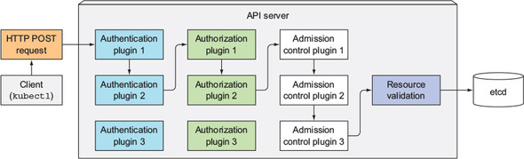

TIL :: 19_03_31

# kubernetes security :: cluster manager

- cluster manager는 PodSecurityPolicy resource(non-namespace)를 통해 pod에서 사용할 수 있거나 사용할 수 없는 보안 관련 기능이 무엇인지 명세할 수 있다.
- PodSecurityPolicy는 master node의 API server에서 PodSecurityPolicy admission control plugin에 의해 수행된다.
  - api server로 pod resource를 배포했을 때 PodSecurityPolicy admission control plugin에 의에 구성된 PodSecurityPolicy들을 기반으로 유효성 검사를 한다.
  - 뿐만아니라 plugin은 정책에 구성된 default 값을 바탕으로 pod resource를 수정한다.
  - pod을 새로 생성하거나 update할 때 반영되므로 기존에 배포된 pod에는 영향을 미치지 않는다.

## PodSecurityPolicy
- pod이 IPC, PID or hostNetwork를 사용할 수 있는지 여부
- pod이 binding할 수 있는 host port
- container가 실행 할 수 있는 userId
- container가 실핼 할 수 있는 fsGroup
- pod를 privileged mode로 실행할 수 있는지 여부
- default securityContext의 capabilities
- pod이 사용할 수 있는 volume type

- container가 사용할 수 있는 SELinux label
- container가 쓰기 가능한 root file system을 사용할 수 있는지 여부

```yaml
apiVersion: extensions/v1beta1
kind: PodSecurityPolicy
metadata:
  name: default
spec:
  hostIPC: false                # host IPC 사용 x
  hostPID: false                # host PID 사용 x
  hostNetwork: false            # host network interface 사용 x
  hostPorts:                    # 1000 ~ 11000, 13000 ~ 14000 port만 사용
  - min: 10000
    max: 11000
  - min: 13000
    max: 14000
  privileged: false             # 권한모드 x
  readOnlyRootFilesystem: true  # root file system에 쓰기 x
  runAsUser:                    # any userID
    rule: RunAsAny
  fsGroup:                      # any fsGroup
    rule: RunAsAny
  supplementalGroups:           
    rule: RunAsAny
  seLinux:                      # any SELinux group
    rule: RunAsAny
  volumes:                      # any volume
  - '*'


apiVersion: extensions/v1beta1
kind: PodSecurityPolicy
metadata:
  name: default
spec:
  hostIPC: false              
  hostPID: false              
  hostNetwork: false          
  hostPorts:                  
  - min: 10000
    max: 11000
  - min: 13000
    max: 14000
  privileged: false           
  readOnlyRootFilesystem: true
  runAsUser:                  
    rule: 'MustRunAs'
    ranges:
    - min: 405
      max: 405
  fsGroup:                    
    rule: 'RunAsAny'
  supplementalGroups:           
    rule: 'RunAsAny'
  seLinux:                    
    rule: 'RunAsAny'
  volumes:                    
  - '*'
```

### runAsUser, fsGroup, supplementGroups
- ```MustRunAs```를 통해 허용된 id 범위를 명세할 수 있다.
- 만약 
```yaml
runAsUser:
  rule: MustRunAs
  ranges:
  - min: 2
    max: 2
fsGroup:
  rule: MustRunAs
  ranges:
  - min: 2
    max: 10
  - min: 20
    max: 30
supplementalGroups:
  rule: MustRunAs
  ranges:
  - min: 2
    max: 10
  - min: 20
    max: 30
```
- ```MustRunAsNonRoot```를 통해 user가 root인 container를 배포하지 못하게 할 수 있다.
```yaml
runAsUser:
  rule: MustRunAs
```

### container userId 명시 방법
- Dockerfile :: USER
- pod resource yaml :: securityContext.runAsUser
- PodSecurityPolicy 

> PodSecurityPolicy는 pod 배포시 api server단에서 resource yaml을 검사하는 것이므로 pod의 securityContext에 명시된 runAsUser가 policy가 허용한 범위내의 userId가 아닌경우 배포가 차단되지만 Dockerfile에 명시된 user인 경우 검사하지 못한다. 만약 policy에 min, max값을 동일하게 해서 특정 userId로 실행하도록 설정되어 있다면 Dockerfile에 명신된 USER를 override해서 실행한다.

### linux capabilities 제어
- PodSecurityPolicy의 ```allowedCapabilities, defaultAddCapabilities, requiredDropCapabilities```를 통해 pod의 securityContext의 capabilities를 제어할 수 있다.
```yaml
apiVersion: extensions/v1beta1
kind: PodSecurityPolicy
spec:
  allowedCapabilities:
  - SYS_TIME
  defaultAddCapabilities:
  - CHOWN
  requiredDropCapabilities:
  - SYS_ADMIN
  - SYS_MODULE
...
```
- allowedCapabilities: securityContext.capabilities.add에 추가할 수 있는 기능들의 지정 (선택지)
- defaultAddCapabilities: securityContext.capabilities에 default로 추가된다.
  - 만약 해당 container에서 기능을 가지기를 원하지 않으면 명시적으로 기능을 제거해야 한다.
- requireDropCapabilities: securityContext.capabilities.drop에 자동으로 추가
  - securityContext.capabilities.add에 해당 기능들을 명시한다면 실행을 거부한다.


### pod가 사용할 수 있는 volume type 제한
```yaml
kind: PodSecurityPolicy
spec:
  volumes:
  - emptyDir
  - configMap
  - secret
  - downwardAPI
  - persistentVolumeClaim
```

### PodSecurityPolicy with RBAC


## pod network 분리

### namespace에서 network 격리
```yaml

apiVersion: networking.k8s.io/v1
kind: NetworkPolicy
metadata:
  name: default-deny
spec:
  podSelector: # podSelector를 비우면 동일한 namespace의 모든 pod에 match
```

### namespace의 일부 pod만 특정 pod에 연결 허용
```yaml
apiVersion: networking.k8s.io/v1
kind: NetworkPolicy
metadata:
  name: postgres-netpolicy
spec:
  podSelector:
    matchLabels:
      app: database
  ingress:
  - from:
    - podSelector:
        matchLabels:
          app: webserver
    ports:
    - port: 5432
```


> cluster에서 사용되는 CNI plugin 또는 다른 유형의 networking solution은 NetworkPolicy를 지원해야하며, 그렇지 않으면 pod간 연결에 아무런 영향을 미치지 않는다.


### 특정 namespace의 pod만 특정 pod에 연결 허용
- namespace는 kubernetes의 논리적 그룹
```yaml
apiVersion: networking.k8s.io/v1
kind: NetworkPolicy
metadata:
  name: shoppingcart-netpolicy
spec:
  podSelector:
    matchLabels:
      app: shopping-cart
  ingress:
  - from:
    - namespaceSelector:
        matchLabels:
          tenant: manning
    ports:
    - port: 80
```


### CIDR 표기법을 사용한 격리
- namespace는 kubernetes의 논리적 그룹
```yaml
apiVersion: networking.k8s.io/v1
kind: NetworkPolicy
metadata:
  name: shoppingcart-netpolicy
spec:
  podSelector:
    matchLabels:
      app: shopping-cart
  ingress:
  - from:
    - ipBlock:
        cidr: 192.168.1.0/24
```

### pod의 outbound traffic 제한
```yaml
apiVersion: networking.k8s.io/v1
kind: NetworkPolicy
metadata:
  name: egress-policy
spec:
  podSelector:
    matchLabels:
      app: webserver
egress: 
- to:
  - podSelector:
    matchLabels:
      app: database
```


# Question
- 만약 PodSecurityPolicy에 runAsUser가 MustAsRun으로 범위를 정해놓고 Dockerfile에서 root로 실행할 경우 container process의 userId
- allowedCapabilities에 명시되지 않은 기능들을 securityContext.capabilities에 명시할 경우 배포가 가능한지?