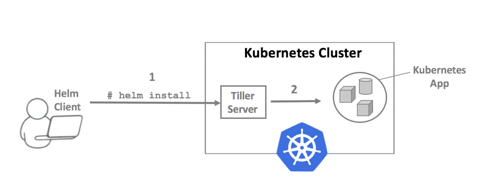
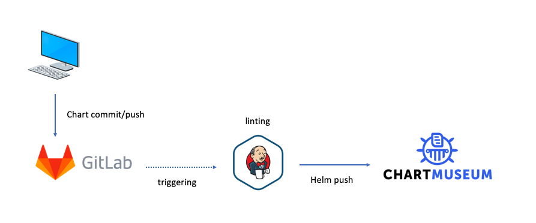

TIL :: 19_04_15

# Helm 
- kubernetes 패키지 매니저 (≈ npm, pip, ..)

# Helm architecture

- helm은 client-server 구조로 이루어져 있다.
- server역활인 tiller는 ```helm init```을 통해 kubernetes에 pod으로 배포된다.
- helm client에서 ```helm install``` 명령으로 chart를 gRPC 통신으로 tiller에게 전달된다.

```yaml
# helm init -o yaml

apiVersion: extensions/v1beta1
kind: Deployment
metadata:
  creationTimestamp: null
  labels:
    app: helm
    name: tiller
  name: tiller-deploy
  namespace: kube-system
spec:
  replicas: 1
  strategy: {}
  template:
    metadata:
      creationTimestamp: null
      labels:
        app: helm
        name: tiller
    spec:
      automountServiceAccountToken: true
      containers:
      - env:
        - name: TILLER_NAMESPACE
          value: kube-system
        - name: TILLER_HISTORY_MAX
          value: "0"
        image: gcr.io/kubernetes-helm/tiller:v2.13.1
        imagePullPolicy: IfNotPresent
        livenessProbe:
          httpGet:
            path: /liveness
            port: 44135
          initialDelaySeconds: 1
          timeoutSeconds: 1
        name: tiller
        ports:
        - containerPort: 44134
          name: tiller
        - containerPort: 44135
          name: http
        readinessProbe:
          httpGet:
            path: /readiness
            port: 44135
          initialDelaySeconds: 1
          timeoutSeconds: 1
        resources: {}
status: {}

---
apiVersion: v1
kind: Service
metadata:
  creationTimestamp: null
  labels:
    app: helm
    name: tiller
  name: tiller-deploy
  namespace: kube-system
spec:
  ports:
  - name: tiller
    port: 44134
    targetPort: tiller
  selector:
    app: helm
    name: tiller
  type: ClusterIP
status:
  loadBalancer: {}
```

# Chart
- chart는 application 이름인 directory 아래에 다양한 file들로 구성
```sh
wordpress/
  Chart.yaml          # A YAML file containing information about the chart
  LICENSE             # OPTIONAL: A plain text file containing the license for the chart
  README.md           # OPTIONAL: A human-readable README file
  requirements.yaml   # OPTIONAL: A YAML file listing dependencies for the chart
  values.yaml         # The default configuration values for this chart
  charts/             # A directory containing any charts upon which this chart depends.
  templates/          # A directory of templates that, when combined with values,
                      # will generate valid Kubernetes manifest files.
  templates/NOTES.txt # OPTIONAL: A plain text file containing short usage notes
```

## Chart - Chart.yaml
```yaml
apiVersion: "v1" (required)
name: Chart 이름 (required)
version: SemVer 2 형식의 Chart 버전 (required)
kubeVersion: 쿠베 버전 (optional)
description: Chart 설명 (optional)
keywords:
  - A list of keywords about this project (optional)
home: The URL of this project's home page (optional)
sources:
  - A list of URLs to source code for this project (optional)
maintainers: # (optional)
  - name: The maintainer's name (required for each maintainer)
    email: The maintainer's email (optional for each maintainer)
    url: A URL for the maintainer (optional for each maintainer)
engine: gotpl # The name of the template engine (optional, defaults to gotpl)
icon: A URL to an SVG or PNG image to be used as an icon (optional).
appVersion: The version of the app that this contains (optional). This needn't be SemVer.
deprecated: Whether this chart is deprecated (optional, boolean)
tillerVersion: The version of Tiller that this chart requires. This should be expressed as a SemVer range: ">2.0.0" (optional)
```

## Chart - requirements.yaml
- chart가 다른 chart들과 의존 관계가 있을 경우 명세
- ```helm dependency update(helm dep up)``` 명령어를 사용하면 requirement.yaml 파일에 정의된 chart들을 ```charts/``` directory안에 넣는다.
```yaml
dependencies:
  - name: apache
    version: 1.2.3
    repository: http://example.com/charts
  - name: mysql
    version: 3.2.1
    repository: http://another.example.com/charts
```
```sh
$ helm dep up foochart
Hang tight while we grab the latest from your chart repositories...
...Successfully got an update from the "local" chart repository
...Successfully got an update from the "stable" chart repository
...Successfully got an update from the "example" chart repository
...Successfully got an update from the "another" chart repository
Update Complete. Happy helming!
Saving 2 charts
Downloading apache from repo http://example.com/charts
Downloading mysql from repo http://another.example.com/charts

---


charts/
  apache-1.2.3.tgz
  mysql-3.2.1.tgz
```


## Chart - template
- tiller는 rendering시점에 value.yaml값들을 참조하여 kubernertes resource정의 파일을 생성한다.
- go template language, spring library로 구현

```yaml
apiVersion: v1
kind: ReplicationController
metadata:
  name: deis-database
  namespace: deis
  labels:
    app.kubernetes.io/managed-by: deis
spec:
  replicas: 1
  selector:
    app.kubernetes.io/name: deis-database
  template:
    metadata:
      labels:
        app.kubernetes.io/name: deis-database
    spec:
      serviceAccount: deis-database
      containers:
        - name: deis-database
          image: {{.Values.imageRegistry}}/postgres:{{.Values.dockerTag}}
          imagePullPolicy: {{.Values.pullPolicy}}
          ports:
            - containerPort: 5432
          env:
            - name: DATABASE_STORAGE
              value: {{default "minio" .Values.storage}}
```

## Chart - Value.yaml
```
imageRegistry: "quay.io/deis"
dockerTag: "latest"
pullPolicy: "Always"
storage: "s3"
```

## Chart - Predefined Values
```
Predefined Values
helm에는 아래와 같은 변수들이 미리 선언되어 있어서 따로 선언하지 않아도 바로 사용할 수 있습니다.

Release.Name: 배포된 release의 이름
Release.Time: release가 최근 update된 시간
Release.Namespace: release가 속한 namespace 이름
Release.Service: release를 배포한 서비스명. 우리는 tiller로 배포했으므로 이 값은 Tiller
Release.IsUpgrade: 현재 release가 upgrade/rollback 중이면 이 값이 true
Release.IsInstall: 현재 release가 install 중이면 이 값이 true
Release.Revision: 첫 install시 1로 세팅. upgrade가 수행될때마다 1씩 증가함

Chart: Chart.yaml 파일 내용 (ex: Chart.Version)
Capabilities: kubernetes 관련 정보를 얻어 올 수 있응 객체. (ex: {{.Capabilities.KuberVersion}})
```
- 만약 chart가 다른 chart와 dependency가 있어 requirement로 chart들을 받아 올 경우 부모 chart에선 자식 chart value들을 사용할 수 있다.
- 만약 자식 chart에서 부모 chart의 value를 사용하고 싶을 경우엔 부모 chart value에 global로 선언을 해야한다.
```yaml
global:
  app: MyGlobalVariable
```

# helm cheatsheet
```sh
$ helm init
$ helm repo list
$ helm search | grep mysql
$ helm fetch stable/mysql -d mysql/
$ helm repo index mysql/ --url https://helm.example.repo.com/charts
$ helm repo add private-repo https://helm.example.repo.com --username {username} --password {passwd}
```

--- 

# helm private repository 
- chartmuseum을 통해 helm private repository 구축
  - go로 작성된 helm chart repository server를 구축할 수 있는 오픈소스 라이브러리
  - [chartmuseum](https://chartmuseum.com/docs/#)
  - [chartmuseumUI](https://github.com/chartmuseum/ui)

## install chartmuseum

```sh
# manually
$ curl -LO https://s3.amazonaws.com/chartmuseum/release/latest/bin/linux/amd64/chartmuseum
$ chmod +x ./chartmuseum
$ mv ./chartmuseum /usr/local/bin

$ chartmuseum \
  --debug \
  --port=8080 \
  --storage="local" \
  --storage-local-rootdir="./chartstorage"


# docker
version: '3.0'
services:
  chartmuseum:
    container_name: helm-repo
    image: chartmuseum/chartmuseum:latest
    volumes:
    - ./chartstorage:/app/storage
    restart: always
    environment:
    PORT: 8080
    DEBUG: 1
    STORAGE: "local"
    STORAGE_LOCAL_ROOTDIR: "/app/storage"
    ports:
    - 8080:8080
```

## chartmuseum support storage
- aws s3
- google cloud storage
- azure blob storage
- ablibaba cloud oss storage
- openstack object storage
- local disk


## 1. upload chart package (manually)
```
# chart packaging 하기
$ cd mychart/
$ helm package .
Successfully packaged chart and saved it to: working_dir/mychart-0.3.2.tgz

# chart 업로드
$ curl --data-binary "@mychart-0.3.2.tgz" http://{chartmuseum url}/api/charts
```

## 2. upload chart package (helm-push plugin)
- [helm-push plugin](https://github.com/chartmuseum/helm-push)
```sh
$ helm push mychart/ chartmuseum
```


## helm chart CD
