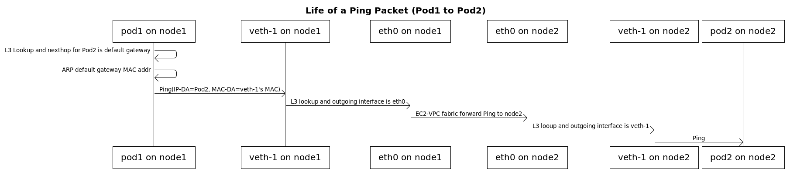

TIL :: 19_09_01

# EKS

## Networking
- VPC for EKS
- EKS VPC considerations
- EKS SG considerations
- Pod networking
  - amazon vpc cni를 통한 native AWS VPC networking
  - [amazon-vpc-cni-k8s](https://github.com/aws/amazon-vpc-cni-k8s)
    - worker node에 VPC ip들을 할당을 하여 각 node에서 구동중인 pod들을 networking 설정을 책임진다.
    - components
      - L-IPAM daemon
        - node에 eni와 secondary ip를 부여하는 역할을 한다.
        - pod가 scheduling 됬을 때 부여하기 위한 warm pool ip 주소들을 관리한다.
      - CNI plugin
        - host network와의 연결을 책임 (interface & veth)
    - 각 instance마다 정해진 max eni가 있으며 각 eni당 여러개의 ip address를 가진다.
    - 각 eni당 primary ip를 가지고 나머지 ip들은 secondary ip addresses이다.
    - primary ip는 (사용자 workload)pod에 할당되지 않으며 pod들과 외부와의 traffic routing에 사용된다.
    - 

## VPC cni
- Life of pod to pod ping packet

- Life of pod to External packet
